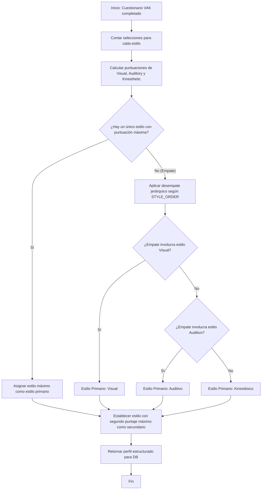
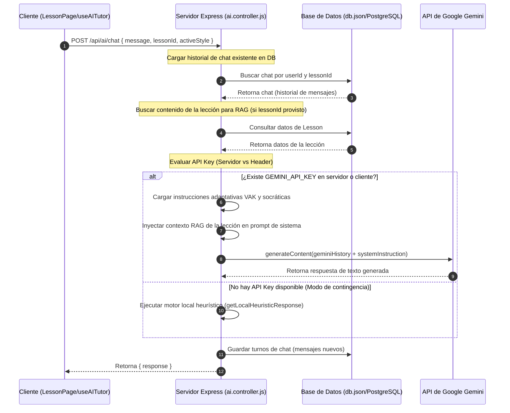

# Documentación técnica · EduPlatform

> **Plataforma educativa adaptativa con IA para estudiantes universitarios colombianos**
> Universidad de Córdoba — Asignatura de Emprendimiento, 3er corte
> Autores: José Gil Soto Méndez · Frank Manuel García Pernett · Tomás David González López
> Versión: `1.0.0-fullstack`

---

## Tabla de contenidos

1. [Resumen del proyecto](#1-resumen-del-proyecto)
2. [Stack tecnológico](#2-stack-tecnológico)
3. [Instalación y ejecución](#3-instalación-y-ejecución)
4. [Estructura del repositorio](#4-estructura-del-repositorio)
5. [Arquitectura del sistema](#5-arquitectura-del-sistema)
6. [Modelo de datos y base de datos](#6-modelo-de-datos-y-base-de-datos)
7. [Sistema de rutas y autenticación](#7-sistema-de-rutas-y-autenticación)
8. [Gestión de estado en Frontend (Context API)](#8-gestión-de-estado-en-frontend-context-api)
9. [Algoritmos de Adaptabilidad e Inteligencia Artificial](#9-algoritmos-de-adaptabilidad-e-inteligencia-artificial)
10. [Capa de servicios del Frontend (API Client)](#10-capa-de-servicios-del-frontend-api-client)
11. [Hooks personalizados](#11-hooks-personalizados)
12. [Sistema de temas y accesibilidad](#12-sistema-de-temas-y-accesibilidad)
13. [Pruebas unitarias automatizadas](#13-pruebas-unitarias-automatizadas)
14. [Convenciones de código](#14-convenciones-de-código)
15. [Evolución del proyecto y trabajo futuro](#15-evolución-del-proyecto-y-trabajo-futuro)

---

## 1. Resumen del proyecto

EduPlatform es una plataforma de aprendizaje adaptativo web **full-stack** que demuestra una experiencia educativa personalizada según el estilo cognitivo del estudiante. La aplicación:

- Diagnostica el perfil **VAK** (Visual / Auditivo / Kinestésico) mediante 10 preguntas.
- Adapta el orden y la modalidad de las lecciones al perfil detectado en tiempo real.
- Calcula el **riesgo de deserción** estudiantil a partir de métricas de comportamiento integradas.
- Ofrece un **tutor inteligente real** que utiliza la API de Google Gemini, adaptando su estrategia pedagógica y tono según el estilo de aprendizaje del estudiante, inyectando el contexto de la lección mediante técnicas RAG (Retrieval Augmented Generation).
- Incluye un **dashboard docente** completo con KPIs del aula, gráficos de distribución VAK, alertas tempranas e intervenciones personalizadas.

El sistema funciona con un backend en Node.js + Express que almacena la información de manera persistente en una base de datos local basada en archivos JSON (`backend/data/db.json`) y maneja sesiones seguras utilizando tokens JWT.

---

## 2. Stack tecnológico

### Backend
- **Node.js** v18+ (Entorno de ejecución)
- **Express.js** v4 (Framework de API REST)
- **JWT (jsonwebtoken)** (Autenticación basada en tokens de sesión)
- **bcryptjs** (Hash y encriptación de contraseñas)
- **@google/genai** (SDK oficial para integración con Gemini)
- **dotenv** (Gestión de variables de entorno)

### Frontend
- **React.js** `^19.2.6` (Biblioteca UI en SPA)
- **Vite** `^8.0.12` (Bundler y entorno de desarrollo rápido)
- **react-router-dom** `^7.15.1` (Gestión de enrutamiento)
- **Recharts** `^3.8.1` (Gráficas estadísticas de progreso e indicadores)
- **Framer Motion** `^12.40.0` (Librería de animaciones fluidas)
- **CSS Modules + CSS Variables** (Control y encapsulación de estilos)
- **Font Awesome 6 (CDN)** (Iconografía consistente)
- **Google Fonts (Inter + Syne)** (Tipografía optimizada)

### Control de Calidad y Pruebas
- **Vitest** `^4.1.8` (Framework de pruebas unitarias ultra rápido compatible con Vite)
- **ESLint** + **Prettier** (Linter y formateador de código)

---

## 3. Instalación y ejecución

### Requisitos previos
- Node.js ≥ 18
- npm ≥ 9

### Pasos para iniciar el sistema

#### 1. Clonar y configurar el Backend
```bash
cd backend
npm install
```
*(Opcional)* Crea un archivo `.env` en la raíz de `backend/` con tu API Key de Gemini:
```env
PORT=3001
JWT_SECRET=tu_clave_secreta_jwt_para_firmar_tokens
GEMINI_API_KEY=tu_api_key_de_google_gemini
```
Inicia el servidor backend:
```bash
npm start
```
El servidor REST estará corriendo en `http://localhost:3001`.

#### 2. Iniciar el Frontend
En la raíz del proyecto EduPlatform:
```bash
npm install
npm run dev
```
La aplicación web se levantará en `http://localhost:5173`.

---

## 4. Estructura del repositorio

```
EduPlatform/
├── backend/                    # Código del Servidor API REST
│   ├── data/                   # Almacén de persistencia local
│   │   └── db.json             # Base de datos en formato JSON
│   ├── db.js                   # Mocks iniciales, lógica de siembra (seed) y guardado
│   ├── server.js               # Rutas Express de Auth, Cursos, Comunidad, Progreso y Chatbot Gemini
│   ├── utils.js                # Algoritmos compartidos (Clasificador VAK, Cálculo de Riesgo)
│   └── package.json            # Dependencias del servidor backend
├── src/                        # Aplicación Frontend React
│   ├── App.jsx                # Composición de Providers y punto de entrada UI
│   ├── main.jsx               # Renderizador React con StrictMode y enrutador
│   ├── components/
│   │   ├── charts/            # RadarVAK y WeeklyProgressChart (recharts)
│   │   ├── common/            # Componentes reutilizables (Button, Card, Input, Modal, etc.)
│   │   └── feedback/          # Componentes de carga y avisos (Skeleton, Toast, EmptyState)
│   ├── config/
│   │   ├── ProtectedRoute.jsx # Guard de enrutamiento por autenticación y rol
│   │   └── routes.config.jsx  # Configuración centralizada de rutas
│   ├── constants/
│   │   ├── config.js          # Constantes y Enums globales
│   │   ├── learningStyles.js  # Metadata y orden de prioridad VAK
│   │   ├── messages.js        # Textos informativos de éxito, alerta y errores
│   │   └── routes.js          # Helper de rutas
│   ├── context/
│   │   ├── UserContext.jsx    # Estado global del usuario y sesión
│   │   ├── ThemeContext.jsx   # Accesibilidad (temas, fuentes, reducción de movimiento)
│   │   ├── NotificationContext.jsx # Notificaciones del Topbar y Toasts
│   │   └── ProgressContext.jsx # Progreso académico del estudiante en sesión
│   ├── hooks/
│   │   ├── useAuth.js         # Lógica de login, logout y cargas demo
│   │   ├── useDiagnostic.js   # Máquina de estados para el cuestionario diagnóstio
│   │   ├── useAdaptiveRoute.js # Filtros y adaptadores de lecciones/módulos
│   │   ├── useAITutor.js      # Conexión con chatbot y disparador de eventos locales
│   │   ├── useDropoutRisk.js  # Visualización del nivel de riesgo
│   │   └── useProgress.js     # Carga de métricas de avance
│   ├── pages/
│   │   ├── auth/              # LoginPage y RegisterPage
│   │   ├── onboarding/        # WelcomePage y DiagnosticPage
│   │   ├── student/           # Dashboards, Cursos, Visualizador de Lección adaptada y Ajustes
│   │   ├── teacher/           # Dashboard docente de analíticas del aula
│   │   └── shared/            # Página de error 404
│   ├── services/              # Cliente HTTP que consume los endpoints del backend
│   │   └── ...service.js      # auth, diagnostic, course, progress, community, teacher, ai
│   ├── styles/                # Tokens de diseño CSS y temas de accesibilidad
│   ├── tests/                 # Directorio de pruebas automatizadas (Vitest)
│   │   ├── riskCalculator.test.js
│   │   └── vakClassifier.test.js
│   └── utils/
│       ├── api.js             # Wrapper HTTP de Fetch con inyección automática de JWT
│       ├── storage.js         # Wrapper para localStorage con prefijo edu_
│       └── ...                # Validadores y formateadores visuales
├── index.html
├── vite.config.js              # Configuración del bundler y alias @ -> src/
└── package.json                # Dependencias del cliente y scripts npm
```

---

## 5. Arquitectura del sistema

La aplicación se compone de un frontend estructurado en 4 capas lógicas estrictas que interactúan con un backend API REST seguro:

```
┌──────────────────────────────────────────────────────────────┐
│  Capa 1: UI / Presentación (pages/, components/)              │
│  Consume estados y lógica expuestos por hooks y context.     │
└──────────────────────┬───────────────────────────────────────┘
                       │ Hooks personalizados
┌──────────────────────▼───────────────────────────────────────┐
│  Capa 2: Lógica de negocio (hooks/)                          │
│  Mapea flujos de interacción e interactúa con los servicios. │
└──────────────────────┬───────────────────────────────────────┘
                       │ Llamadas asíncronas con token JWT
┌──────────────────────▼───────────────────────────────────────┐
│  Capa 3: Acceso a datos (services/ y utils/api)              │
│  Clientes HTTP que realizan peticiones al backend.          │
└──────────────────────┬───────────────────────────────────────┘
                       │ Protocolo HTTP REST (Puerto 3001)
┌──────────────────────▼───────────────────────────────────────┐
│  Capa 4: Servidor Backend & DB (backend/server.js)            │
│  Endpoints Express, control de sesión JWT, y RAG con Gemini.│
│  Almacena y extrae de backend/data/db.json.                  │
└──────────────────────────────────────────────────────────────┘
```

---

## 6. Modelo de datos y base de datos

El almacenamiento se realiza en `backend/data/db.json`. A continuación, se detallan los esquemas clave que se guardan y manipulan dinámicamente en el backend:

### `User` (Estudiante / Docente)
```json
{
  "id": "u_001",
  "name": "Brigitte Pico Peralta",
  "email": "brigitte@unicordoba.edu.co",
  "passwordHash": "$2a$10$...",
  "role": "student", // o "teacher"
  "avatar": null,
  "university": "Universidad de Córdoba",
  "program": "Ingeniería de Sistemas",
  "semester": 9,
  "cognitiveProfile": {
    "primary": "visual",
    "secondary": "kinesthetic",
    "scores": { "visual": 7, "auditory": 2, "kinesthetic": 5 },
    "diagnosedAt": "2026-03-15T10:00:00Z"
  },
  "preferences": {
    "theme": "light",
    "fontSize": "normal",
    "reducedMotion": false
  },
  "stats": {
    "daysSinceLastLogin": 1,
    "completedLessonsThisWeek": 4,
    "avgQuizScore": 0.78,
    "missedDeadlines": 0,
    "totalStudyMinutes": 1840,
    "streak": 7
  },
  "enrolledCourses": ["c_001", "c_002"],
  "joinedAt": "2026-02-01T08:00:00Z"
}
```

### `Course`
```json
{
  "id": "c_001",
  "title": "Matemáticas Básicas",
  "description": "Fundamentos matemáticos esenciales...",
  "category": "mathematics",
  "icon": "fa-calculator",
  "color": "#4f46e5",
  "instructor": "Prof. José Gil Soto Méndez",
  "modules": [
    {
      "id": "m_001",
      "title": "Módulo 1: Álgebra Fundamental",
      "description": "Operaciones con variables...",
      "lessons": ["l_001", "l_002"],
      "completed": false
    }
  ],
  "progress": 0.62,
  "status": "in_progress",
  "adaptedFor": "visual",
  "tags": ["MEN", "ICFES"],
  "rating": 4.7,
  "enrolled": 248
}
```

### `Lesson`
Cada lección almacena sus contenidos segregados por estilo cognitivo en el mapa `contentByStyle`, lo cual permite al frontend mostrar dinámicamente la modalidad idónea:
```json
{
  "id": "l_001",
  "courseId": "c_001",
  "moduleId": "m_001",
  "title": "Introducción al Álgebra",
  "type": "video",
  "duration": 12,
  "quiz": [
    {
      "id": "q_001",
      "question": "¿Cuál es el resultado de resolver 2x + 4 = 10?",
      "options": ["x = 2", "x = 3", "x = 4", "x = 5"],
      "correct": 1,
      "explanation": "Restando 4 a ambos lados: 2x = 6, dividiendo entre 2: x = 3."
    }
  ],
  "contentByStyle": {
    "visual": {
      "title": "Álgebra en imágenes",
      "description": "Aprende álgebra mediante diagramas visuales.",
      "duration": "12 min"
    },
    "auditory": {
      "title": "Podcast: ¿Qué es el álgebra?",
      "description": "Explicación oral...",
      "transcript": "El álgebra es la rama...",
      "duration": "15 min"
    },
    "kinesthetic": {
      "title": "Reto práctico de balanceo",
      "description": "Resuelve interactivos...",
      "steps": ["Paso 1", "Paso 2"],
      "duration": "20 min"
    }
  }
}
```

### `Chat`
Cada chat asocia a un estudiante con una lección específica (o `null` si es una consulta general de tutoría) y almacena secuencialmente el historial de turnos de la conversación en un arreglo de mensajes:
```json
{
  "id": "chat_1780626219625",
  "userId": "u_001",
  "lessonId": "l_001",
  "messages": [
    {
      "id": "msg_1780626219625",
      "text": "¿Cómo despejo x en 3x - 6 = 0?",
      "sender": "student",
      "timestamp": "2026-06-05T03:22:00Z"
    },
    {
      "id": "msg_1780626219626",
      "text": "¡Hola! Vamos a verlo juntos paso a paso. Antes de hacer cálculos, ¿qué operación deberías aplicar en ambos lados para mover el -6?",
      "sender": "tutor",
      "timestamp": "2026-06-05T03:22:05Z"
    }
  ]
}
```

### `Submission`
Almacena las entregas académicas de archivos y tareas en PDF de los estudiantes, vinculando el archivo físico y la calificación/retroalimentación automática de la IA:
```json
{
  "id": "sub_001",
  "userId": "u_001",
  "lessonId": "l_001",
  "lessonTitle": "Introducción al Álgebra",
  "fileName": "tarea_algebra.pdf",
  "filePath": "backend/uploads/tarea_algebra.pdf",
  "score": 4.5,
  "feedback": "Excelente desarrollo del despeje de variables. Corrige el signo en el ejercicio 3.",
  "timestamp": "2026-06-05T03:25:00Z"
}
```

---

## 7. Sistema de rutas y autenticación

### Autenticación con JWT
- Cuando un usuario inicia sesión en `/api/auth/login` o se registra en `/api/auth/register`, el backend genera y firma un token JWT utilizando una clave privada (`JWT_SECRET`).
- Este token es devuelto al cliente y almacenado en el `localStorage` del navegador con la clave `edu_token`.
- En el cliente, el archivo [src/utils/api.js](src/utils/api.js) intercepta todas las peticiones asíncronas e inyecta el token en el header `Authorization: Bearer <token>`.
- El middleware `authenticateToken` del backend extrae y verifica el token. Si es correcto, añade la información del usuario desencriptada al objeto `req.user` para uso en los controladores.

### Flujo de Redirección Inteligente
En el frontend, tras iniciar sesión, el custom hook `useAuth.js` determina el destino del usuario según las siguientes reglas:
1. Si su rol es `'teacher'`, se le redirige al Dashboard Docente (`/teacher/dashboard`).
2. Si su rol es `'student'` y no ha completado el diagnóstico cognitivo (`cognitiveProfile` es `null`), se le redirige automáticamente a la pantalla de bienvenida y cuestionario (`/onboarding/welcome`).
3. Si ya tiene su perfil diagnosticado, va directo a su panel académico (`/student/dashboard`).

### Especificaciones de Endpoints de Tutoría e Historial

#### 1. `GET /api/ai/chat/history`
Obtiene el historial de chat del alumno autenticado.
* **Cabeceras obligatorias**: `Authorization: Bearer <token_jwt>`
* **Parámetros de consulta (Query)**: `lessonId` (opcional: filtra el chat relativo a una lección; si se omite, obtiene el chat general).
* **Respuesta exitosa (200 OK)**:
  ```json
  [
    {
      "id": "msg_1780626219625",
      "text": "¿Cómo despejo x?",
      "sender": "student",
      "timestamp": "2026-06-05T03:22:00Z"
    }
  ]
  ```

#### 2. `POST /api/ai/chat`
Envía un nuevo mensaje al tutor de IA y obtiene su respuesta interactiva (RAG + VAK).
* **Cabeceras obligatorias**: `Authorization: Bearer <token_jwt>`
* **Cabeceras opcionales**: `x-gemini-key` (envía de forma opcional una clave de Gemini del cliente para bypass del servidor).
* **Cuerpo de la petición (JSON)**:
  ```json
  {
    "message": "Hola tutor, ¿me das un ejemplo?",
    "lessonId": "l_001",
    "activeStyle": "visual"
  }
  ```
* **Respuesta exitosa (200 OK)**:
  ```json
  {
    "response": "¡Claro! 🔴 Imagina que tienes una balanza..."
  }
  ```

#### 3. `GET /api/teacher/students/:studentId/chats`
Permite a los profesores auditar y revisar los diálogos de un alumno con el tutor de IA.
* **Cabeceras obligatorias**: `Authorization: Bearer <token_jwt>` (requiere que el usuario decodificado tenga el rol de `"teacher"`).
* **Parámetros de URL**: `studentId` (identificador del estudiante).
* **Respuesta exitosa (200 OK)**:
  ```json
  [
    {
      "id": "chat_1780626219625",
      "userId": "u_001",
      "lessonId": "l_001",
      "lessonTitle": "Introducción al Álgebra",
      "messages": [...]
    }
  ]
  ```

---

## 8. Gestión de estado en Frontend (Context API)

El estado global del cliente está organizado de forma jerárquica en `src/App.jsx`. Es sumamente sensible a variaciones en el orden de los proveedores:

```jsx
<ThemeProvider>             {/* Tema de color, accesibilidad WCAG y fuentes */}
  <UserProvider>            {/* Sesión activa y datos del perfil de usuario */}
    <NotificationProvider>  {/* Alertas de la campana superior y notificaciones flotantes (Toasts) */}
      <ProgressProvider>    {/* Historial de progreso semanal y quices completados */}
        <AppRoutes />       {/* Árbol de enrutamiento */}
      </ProgressProvider>
    </NotificationProvider>
  </UserProvider>
</ThemeProvider>
```

---

## 9. Algoritmos de Adaptabilidad e Inteligencia Artificial

EduPlatform cuenta con tres pilares funcionales de adaptabilidad dinámica desarrollados en backend y frontend:

### 9.1 Clasificador VAK (Modelo Heurístico)
Localizado en `backend/utils.js` (y replicado en el cliente en `src/utils/vakClassifier.js`):
- Cuenta las selecciones del estudiante en las 10 preguntas. Cada opción de respuesta tiene un estilo asociado (`visual`, `auditory` o `kinesthetic`).
- Si hay un empate en puntuaciones de estilos, se aplica un desempate estricto definido por la constante `STYLE_ORDER`: **Visual > Auditivo > Kinestésico**.
- Retorna el perfil estructurado para persistir en la ficha del estudiante: `{ primary, secondary, scores }`.



### 9.2 Cálculo del Riesgo de Deserción Escolar
Localizado en `backend/utils.js` y expuesto en la API `/api/teacher/students` y en el cliente vía `useDropoutRisk.js`:
- Evalúa el objeto `stats` del estudiante sumando pesos ponderados:
  * **Inactividad** (`daysSinceLastLogin > 7`): Peso del `30%` (factor `low_engagement`).
  * **Falta de avance** (`completedLessonsThisWeek === 0`): Peso del `25%` (factor `no_progress`).
  * **Rendimiento bajo** (`avgQuizScore < 0.5`): Peso del `25%` (factor `low_performance`).
  * **Retraso de entregas** (`missedDeadlines > 1`): Peso del `20%` (factor `missed_deadlines`).
- Clasifica el resultado final en tres bandas:
  * **Bajo** (Score `< 0.30`): Representado en verde (`--color-risk-low`).
  * **Medio** (Score `0.30 – 0.60`): Representado en amarillo (`--color-risk-medium`).
  * **Alto** (Score `> 0.60`): Representado en rojo (`--color-risk-high`).

### 9.3 Tutor Inteligente Adaptativo y RAG (Generative AI)
La API de chat en `/api/ai/chat` gestiona la lógica del asistente virtual:
1. **API Keys**: Soporta dos vías de API Key. Primero evalúa si existe la variable de entorno `GEMINI_API_KEY` en el servidor; si no existe, intenta leer la cabecera `x-gemini-key` enviada opcionalmente desde la configuración del cliente (permitiendo al alumno usar su propia clave si el servidor no tiene una configurada).
2. **Contexto RAG**: Si se envía un `lessonId`, el backend busca el contenido de la lección e inyecta en el prompt del sistema la información y transcripción específica del recurso que el estudiante visualiza en ese momento.
3. **Instrucciones Adaptativas de Sistema (VAK)**: Según el estilo de aprendizaje (`activeStyle` del usuario), el backend inyecta reglas de estilo estrictas para que Gemini ajuste su formato:
   - *Estudiantes Visuales*: Uso extensivo de viñetas, saltos de línea claros, palabras clave en negrita, analogías visuales y uso coordinado de emojis de colores.
   - *Estudiantes Auditivos*: Estilo narrativo fluido, analogías sonoras/rítmicas, acrónimos fáciles de deletrear e invitación a leer en voz alta.
   - *Estudiantes Kinestésicos*: Tono interactivo y dinámico, propuesta de micro-retos o experimentos prácticos reales y analogías basadas en la física o la acción.
4. **Respaldo Local (Heurístico)**: Si falla la conexión de red o no existe ninguna API Key disponible, se ejecuta una función de contingencia (`getLocalHeuristicResponse`) que mapea intenciones de texto del usuario (saludos, peticiones de ayuda o solicitudes de consejos) y devuelve respuestas predefinidas que simulan el tono adaptativo VAK.



5. **Reglas Socráticas de Acompañamiento**: La IA tiene prohibido por sistema resolver directamente las preguntas de exámenes, quices o tareas. Utiliza técnicas de *scaffolding* (andamiaje) para desglosar la duda conceptual del estudiante, haciéndole preguntas reflexivas e inductivas a fin de que resuelva el reto académico de forma autónoma.
6. **Incentivo y Disparador de Inactividad**: El frontend monitorea eventos de interacción del mouse, teclado y scroll durante la lectura de la lección. Si transcurren **45 segundos** sin interacción alguna, el componente activa el Tutor de IA inyectando `inactive: true` en la consulta local. Esto genera un aviso contextual dinámico ("¿Todo bien por ahí? Si necesitas un ejemplo...") diseñado para re-enganchar al estudiante en el estudio de manera asíncrona.

---

## 10. Capa de servicios del Frontend (API Client)

La capa de servicios (`src/services/`) gestiona la transferencia asíncrona de datos desde y hacia la API REST del backend:

- `authService.js`: Inicio de sesión, registro, cierre de sesión y logins directos de demostración (`demo-student`, `demo-teacher`).
- `courseService.js`: Obtiene listados de asignaturas, lecciones específicas, envía respuestas de exámenes y reporta finalización de recursos.
- `progressService.js`: Consume los históricos semanales, tareas por hacer y medallas ganadas del alumno.
- `communityService.js`: Carga foros de dudas estudiantiles, publica nuevas discusiones y gestiona likes.
- `teacherService.js`: API restringida al rol docente para KPIs globales, alertas de riesgo dinámicas e intervenciones adaptadas.
- `aiService.js`: Endpoint de comunicación interactiva con el chatbot de Gemini.

---

## 11. Hooks personalizados

Aíslan la lógica de la UI y gestionan transiciones y efectos colaterales de forma limpia:

- `useAuth`: Envuelve la autenticación y las redirecciones lógicas en base al estado de carga.
- `useDiagnostic`: Maneja el flujo secuencial de preguntas y el envío de respuestas del perfil VAK.
- `useAdaptiveRoute`: Implementa la ordenación de módulos en base a coincidencia cognitiva y la extracción del contenido adaptativo del bloque de lecciones.
- `useAITutor`: Orquesta el temporizador de permanencia en lección y los disparadores de interrupción del tutor (por ejemplo, felicitar tras 3 aciertos seguidos o sugerir un descanso a los 20 minutos).
- `useDropoutRisk`: Formatea a labels comprensibles en español las heurísticas de riesgo estudiantil del usuario activo.

---

## 12. Sistema de temas y accesibilidad

EduPlatform implementa directrices de accesibilidad basadas en WCAG 2.1 e inyecta clases directas al elemento `<body>` para reaccionar globalmente:

- **Temas**: Normal, Oscuro (`theme-dark`), Dislexia (`theme-dyslexia` - fuente optimizada de fácil lectura OpenDyslexic), y Alto Contraste (`theme-high-contrast`).
- **Tamaño de texto**: Pequeño, Normal, Grande, y Extra Grande (reescriben los tokens de escala REM en `tokens.css`).
- **Reducción de movimiento**: Desactiva o suaviza las transiciones complejas de Framer Motion cuando el usuario activa la preferencia de animación reducida en ajustes.

---

## 13. Pruebas unitarias y de integración automatizadas

El proyecto utiliza **Vitest** como framework de pruebas unitarias y de integración rápida, garantizando la estabilidad de los flujos del sistema sin depender de servidores o bases de datos externas:

- **Ubicación**: Carpeta [src/tests/](src/tests/).
- **Ejecución**: `npm run test`.
- **Archivos de prueba integrados**:
  * `vakClassifier.test.js`: Valida el conteo de respuestas de cuestionarios, clasificación de dominancias de aprendizaje y la resolución jerárquica de empates (Visual > Auditivo > Kinestésico).
  * `riskCalculator.test.js`: Valida los scores de riesgo resultantes ante variaciones de inactividad, fallas en exámenes y retrasos en fechas límite.
  * `useAdaptiveRoute.test.js`: Asegura que el hook adaptativo filtre y ordene los módulos de estudio priorizando el estilo del usuario (VAK) y que las funciones de fallback elijan la modalidad alternativa idónea de forma síncrona.
  * `authMiddleware.test.js`: Prueba la seguridad del middleware `authenticateToken` del backend frente a firmas JWT correctas, tokens inválidos, expirados, vacíos o mal formateados.
  * `aiService.test.js`: Valida las contingencias heurísticas y la lógica de tutoría local en el cliente (felicitaciones por racha de aciertos, sugerencias de pausa y alertas de inactividad de la página).

---

## 14. Convenciones de código

- **Idioma**: Toda la interfaz y comentarios orientados al usuario final se escriben estrictamente en español. Los errores y logs del sistema usan un estándar neutro.
- **Componentes**: Utilizan la extensión `.jsx` para modular JSX. Se exportan como Named Exports (ej. `export function ModuleCard()`) para garantizar consistencia y auto-importaciones limpias en el IDE.
- **Lógica Pura y Mocks**: Usan la extensión clásica `.js`.
- **Prettier**: Semicolons habilitados, comillas simples para JS y comillas dobles en propiedades JSX.
- **Estilos**: Se emplean estrictamente CSS Modules (`Nombre.module.css`) consumiendo variables y tokens centralizados de [src/styles/tokens.css](src/styles/tokens.css). Se evita el uso de Bootstrap como motor principal de maquetación en favor del sistema nativo de grillas flex y grid personalizadas.

---

## 15. Evolución del proyecto y trabajo futuro

Dado que el MVP original frontend evolucionó a un sistema **full-stack real**, el roadmap del proyecto contempla:

1. **Migración de Base de Datos**: Reemplazar el archivo local `db.json` por una instancia relacional robusta (como PostgreSQL o Supabase) para soportar múltiples accesos concurrentes de estudiantes en producción.
2. **Historial de Chat de IA Persistente (Completado)**: Se implementó de manera completa la persistencia de chats tanto en el archivo local JSON como en base de datos PostgreSQL mapeada con Prisma ORM. Los docentes cuentan con interfaces detalladas para auditar las tutorías por lección y alumno.
3. **Módulo de Tareas y Subida de Archivos**: Permitir a los estudiantes subir tareas reales en formato PDF para ser corregidas y evaluadas dinámicamente por la IA.
4. **Lector de Text-to-Speech nativo**: Integrar motores de voz para el material de lectura, beneficiando directamente a los estudiantes con perfil de aprendizaje auditivo.
