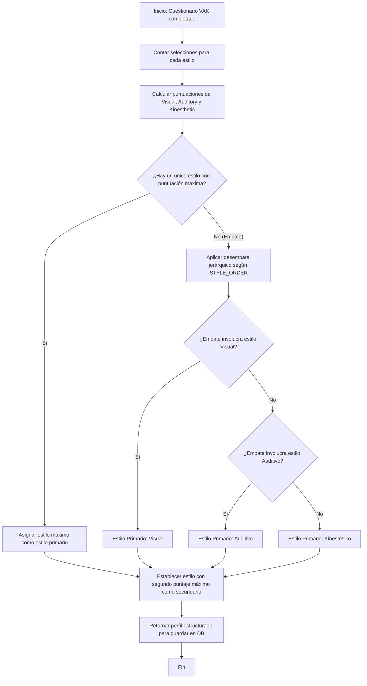
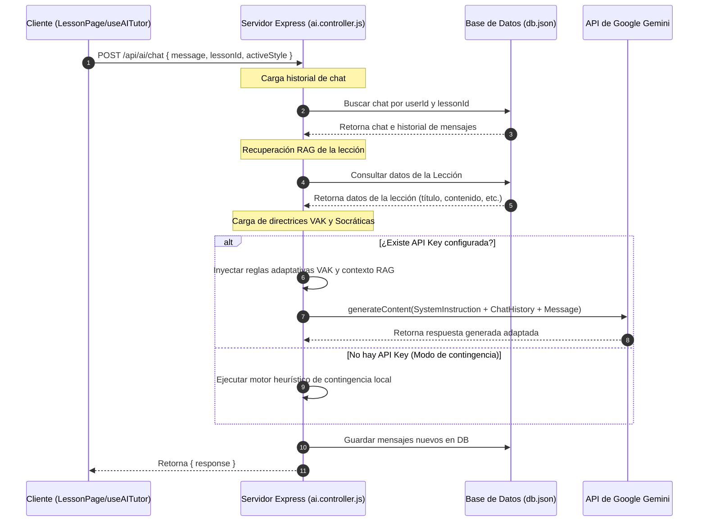

# 🎓 EduPlatform

> **Plataforma Educativa Adaptativa con Inteligencia Artificial para Estudiantes Universitarios Colombianos**  
> 🏫 **Proyecto Académico** · Universidad de Córdoba (Colombia)  
> ✍️ **Autores:** José Gil Soto Méndez · Frank Manuel García Pernett · Tomás David González López  
> 🚀 **Versión:** `1.0.0-fullstack`

---

## 📋 Tabla de Contenidos
1. [Introducción y Propósito](#-introducción-y-propósito)
2. [Características Principales](#-características-principales)
3. [Algoritmos de Adaptabilidad e Inteligencia Artificial](#-algoritmos-de-adaptabilidad-e-inteligencia-artificial)
4. [Arquitectura del Sistema](#-arquitectura-del-sistema)
5. [Estructura del Proyecto](#-estructura-del-proyecto)
6. [Modelo de Datos y Base de Datos](#-modelo-de-datos-y-base-de-datos)
7. [Stack Tecnológico](#-stack-tecnológico)
8. [Instalación y Configuración](#-instalación-y-configuración)
9. [Cuentas Demo de Prueba](#-cuentas-demo-de-prueba)
10. [Pruebas Unitarias y de Integración](#-pruebas-unitarias-y-de-integración)
11. [Roadmap y Trabajo Futuro](#-roadmap-y-trabajo-futuro)
12. [Licencia](#-licencia)

---

## 📖 Introducción y Propósito

### ¿Por qué se creó EduPlatform?
EduPlatform nació como un proyecto académico integrador para el tercer corte de la asignatura de **Emprendimiento** en la **Universidad de Córdoba (Colombia)**. El equipo identificó una de las problemáticas más severas de la educación superior colombiana actual: la **deserción universitaria prematura**, causada frecuentemente por la falta de personalización pedagógica y la brecha digital/cognitiva.

El sistema educativo tradicional funciona bajo un esquema generalizado ("one-size-fits-all"), asumiendo que todos los estudiantes procesan la información de la misma manera. Esto genera frustración, incomprensión y, finalmente, el abandono de los estudios.

### ¿Con qué propósito?
EduPlatform se diseñó con el propósito de **personalizar y democratizar el aprendizaje** mediante la convergencia de dos tecnologías clave:
1. **Modelos Heurísticos Cognitivos**: Basados en el modelo de aprendizaje **VAK** (Visual, Auditivo, Kinestésico).
2. **Inteligencia Artificial Generativa**: Integrando la API de **Google Gemini 3.5 Flash** para actuar como un tutor socrático personal, adaptado en tiempo real al perfil cognitivo de cada estudiante.

El objetivo es doble:
* **Para el Estudiante**: Ofrecerle lecciones adaptadas que prioricen su canal de aprendizaje dominante, y proveerle un tutor virtual que resuelva sus dudas conceptuales sin darle las respuestas directamente (andamiaje socrático).
* **Para el Docente**: Entregar un panel de control con analíticas predictivas que calculen el **riesgo de deserción escolar** de cada alumno en tiempo real, permitiendo intervenciones tempranas y personalizadas basadas en comportamiento.

---

## ✨ Características Principales

### 🎯 1. Diagnóstico Cognitivo VAK
Antes de iniciar el estudio de cualquier asignatura, el estudiante completa un cuestionario interactivo de **10 preguntas adaptadas**. Este cuestionario evalúa las preferencias sensoriales y determina el perfil dominante:
* **Visual**: Aprende mejor mediante imágenes, diagramas, esquemas y negritas.
* **Auditivo**: Aprende mejor escuchando (podcasts, lecturas en voz alta, explicaciones explicativas).
* **Kinestésico**: Aprende mejor interactuando con retos prácticos, simuladores y actividades dinámicas.

### 🔄 2. Contenido Adaptativo y Rutas Dinámicas
Dependiendo del perfil cognitivo resultante (y su perfil secundario), el sistema reestructura los módulos de los cursos. Cada lección cuenta con tres capas de material especializadas. La plataforma presenta automáticamente la modalidad correspondiente al estilo cognitivo principal del estudiante.

### 🤖 3. Tutor Inteligente con IA (RAG + VAK)
Integración nativa con **Google Gemini 3.5 Flash** (vía el SDK `@google/genai`). Utiliza la técnica **RAG (Retrieval Augmented Generation)** para inyectar el contenido y la transcripción de la lección activa en el prompt del sistema. Además, el tutor adapta su formato y tono al perfil cognitivo del usuario en sesión.

### ⚠️ 4. Predicción del Riesgo de Deserción Escolar
Un algoritmo ponderado que evalúa cuatro dimensiones de la conducta del estudiante (inactividad, falta de avance académico, bajo promedio en exámenes y retrasos en entregas), clasificando su riesgo en **Bajo**, **Medio** o **Alto**, y alertando de inmediato al profesor.

### 📊 5. Dashboard Docente
Una interfaz completa para que el educador monitoree la salud del aula. Incluye:
* Gráficas estadísticas en tiempo real (distribución de estilos de aprendizaje mediante gráficos radiales, barras de progreso de cursos).
* Tabla interactiva de alertas tempranas con filtros por nivel de riesgo.
* **Auditoría de Tutorías**: El docente puede entrar a ver el historial detallado de chats entre el estudiante y el tutor de IA para entender en qué temas tienen más dificultades conceptuales.

### ♿ 6. Accesibilidad e Inclusión (WCAG 2.1)
El diseño del frontend incluye opciones avanzadas de accesibilidad:
* **Temas**: Normal, Oscuro, Alto Contraste y **Tema Dislexia** (que cambia toda la tipografía a la fuente especializada *OpenDyslexic*).
* **Escala de Texto**: Pequeño, Normal, Grande y Extra Grande.
* **Reducción de Movimiento**: Opción para deshabilitar o suavizar las animaciones en Framer Motion, ideal para usuarios con sensibilidad visual o equipos de bajo rendimiento.

---

## ⚙️ Algoritmos de Adaptabilidad e Inteligencia Artificial

### 1. Clasificador del Perfil VAK
El algoritmo (localizado en el backend en [backend/utils.js](file:///c:/.../EduPlatform/EduPlatform/backend/utils.js) y replicado en el frontend en [src/utils/vakClassifier.js](file:///c:/.../EduPlatform/EduPlatform/src/utils/vakClassifier.js)) cuenta las elecciones del estudiante en las 10 preguntas. En caso de existir un empate en la puntuación máxima de dos o tres estilos de aprendizaje, se aplica una **jerarquía estricta de desempate**: 

$$\text{Visual} > \text{Auditivo} > \text{Kinestésico}$$

Esto asegura consistencia determinista en la inicialización de los perfiles.



---

### 2. Cálculo del Riesgo de Deserción
Localizado en [backend/utils.js](file:///c:/.../EduPlatform/EduPlatform/backend/utils.js). Evalúa el rendimiento del estudiante devolviendo un valor decimal entre $0.0$ y $1.0$. El cálculo se realiza mediante la siguiente suma ponderada:

$$\text{Riesgo} = (\text{Inactividad} \times 0.30) + (\text{Falta de Avance} \times 0.25) + (\text{Rendimiento Bajo} \times 0.25) + (\text{Retraso Entregas} \times 0.20)$$

Los umbrales se mapean en tres bandas de riesgo:
*   🟢 **Bajo Riesgo**: $< 0.30$
*   🟡 **Medio Riesgo**: $0.30 \le \text{Score} \le 0.60$
*   🔴 **Alto Riesgo**: $> 0.60$

---

### 3. Prompting Socrático y Adaptabilidad VAK del Tutor IA
El endpoint `POST /api/ai/chat` (gestionado en [backend/server.js](file:///c:/.../EduPlatform/EduPlatform/backend/server.js)) implementa las siguientes directrices de sistema para la generación de la IA:
1.  **Reglas Socráticas**: La IA nunca proporciona respuestas directas a las preguntas del cuestionario de la lección ni resuelve tareas. En su lugar, guía de forma reflexiva haciendo preguntas orientadoras.
2.  **RAG Contextual**: Inyecta el contenido y la transcripción correspondiente a la lección activa del estudiante.
3.  **Formateo VAK**:
    *   **Visual**: La respuesta se formatea usando listas con viñetas, términos clave destacados en negrita, saltos de línea abundantes y uso estratégico de emojis ilustrativos.
    *   **Auditivo**: Tono narrativo y rítmico, mnemotecnias sonoras, y sugerencias de lectura en voz alta para favorecer la memoria acústica.
    *   **Kinestésico**: Plantea analogías físicas o retos prácticos simples que involucren objetos cotidianos, invitando a la experimentación empírica.



---

### 4. Monitoreo de Inactividad del Estudiante
Para mejorar la retención de la atención, el custom hook [src/hooks/useAITutor.js](file:///c:/.../EduPlatform/EduPlatform/src/hooks/useAITutor.js) en el frontend monitorea eventos físicos del mouse, teclado y scroll en la lección. Si transcurren **45 segundos** sin interacción, se gatilla automáticamente una burbuja del Tutor de IA para ofrecer ayuda dinámica contextualizada.

---

## 🏗️ Arquitectura del Sistema

El proyecto está diseñado bajo una **arquitectura cliente-servidor desacoplada**:

1.  **Frontend (React SPA)**: Una aplicación interactiva que corre en el navegador. Organizada en **4 capas lógicas estrictas** para garantizar la separación de conceptos:
    *   **Capa 1: Presentación** (`src/pages/`, `src/components/`): Hojas de JSX que renderizan componentes y consumen estados lógicos locales o globales.
    *   **Capa 2: Lógica de negocio** (`src/hooks/`): Custom hooks que encapsulan operaciones lógicas y sincronizaciones.
    *   **Capa 3: Acceso a datos** (`src/services/`): Archivos que manejan llamadas asíncronas HTTP a la API REST.
    *   **Capa 4: Infraestructura** (`src/utils/`, `src/styles/`): Funciones auxiliares puras y hojas de estilo base.
2.  **Backend (Express API REST)**: Servidor Node.js encargado del hashing de contraseñas, validación de sesiones con tokens JWT, persistencia de datos y orquestación de prompts con el modelo LLM de Gemini.
3.  **Base de Datos**: 
    *   **Modo Local**: Utiliza un sistema ligero basado en archivos JSON en `backend/data/db.json` con re-escritura síncrona/asíncrona.
    *   **Modo Producción**: Mapeo completo preparado para base de datos relacional PostgreSQL gestionada con Prisma ORM (ver [backend/package.json](file:///c:/.../EduPlatform/EduPlatform/backend/package.json)).

---

## 📂 Estructura del Proyecto

```
EduPlatform/
├── backend/                    # Código del Servidor API REST
│   ├── data/                   # Almacén de persistencia local
│   │   └── db.json             # Base de datos en formato JSON
│   ├── db.js                   # Mocks iniciales, lógica de siembra (seed) y persistencia
│   ├── server.js               # Rutas Express de Auth, Cursos, Comunidad, Progreso y Chatbot Gemini
│   ├── utils.js                # Algoritmos compartidos (Clasificador VAK, Cálculo de Riesgo)
│   └── package.json            # Dependencias del servidor backend
├── src/                        # Aplicación Frontend React
│   ├── App.jsx                # Composición de Providers globales de estado y punto de entrada UI
│   ├── main.jsx               # Renderizador React con StrictMode y enrutador
│   ├── components/            # Componentes visuales organizados por propósito
│   │   ├── charts/            # RadarVAK y WeeklyProgressChart (visualizaciones con Recharts)
│   │   ├── common/            # Componentes atómicos (Button, Card, Input, Modal, etc.)
│   │   └── feedback/          # Componentes de carga y avisos (Skeleton, Toast, EmptyState)
│   ├── config/                # Ajustes y guards de enrutamiento
│   │   ├── ProtectedRoute.jsx # Guard de enrutamiento por autenticación y rol de usuario
│   │   └── routes.config.jsx  # Configuración centralizada de rutas del cliente
│   ├── constants/             # Constantes, Enums y catálogos de textos
│   │   ├── config.js          # Constantes y Enums globales
│   │   ├── learningStyles.js  # Metadata y orden de prioridad VAK
│   │   ├── messages.js        # Textos informativos y de error centralizados
│   │   └── routes.js          # Helpers de definición de paths
│   ├── context/               # Proveedores de contexto global (Context API)
│   │   ├── UserContext.jsx    # Estado del usuario activo y credenciales de sesión
│   │   ├── ThemeContext.jsx   # Preferencias de accesibilidad (temas, fuentes, movimiento)
│   │   ├── NotificationContext.jsx # Alertas de la campana e inyección de Toasts flotantes
│   │   └── ProgressContext.jsx # Avance académico y logs de completitud del estudiante
│   ├── hooks/                 # Custom hooks que aíslan la lógica de la vista
│   │   ├── useAuth.js         # Inicio, cierre de sesión y flujos de login demo
│   │   ├── useDiagnostic.js   # Máquina de estado interactiva para el test diagnóstico
│   │   ├── useAdaptiveRoute.js # Enrutamiento adaptativo de contenidos VAK
│   │   ├── useAITutor.js      # Conexión del chat e interactividad de la IA
│   │   ├── useDropoutRisk.js  # Conversión de pesos a labels entendibles
│   │   └── useProgress.js     # Cargas de avance del usuario en sesión
│   ├── pages/                 # Páginas de la aplicación (Views)
│   │   ├── auth/              # LoginPage y RegisterPage
│   │   ├── onboarding/        # WelcomePage y DiagnosticPage
│   │   ├── student/           # Dashboards, Lección adaptada, Cursos y Ajustes
│   │   ├── teacher/           # Dashboard docente de analíticas e intervención
│   │   └── shared/            # Vista de error de página (404 Not Found)
│   ├── services/              # Cliente HTTP para llamadas al backend
│   │   └── ...service.js      # auth, diagnostic, course, progress, community, teacher, ai
│   ├── styles/                # Archivos de estilos globales y variables
│   ├── tests/                 # Pruebas unitarias automatizadas (Vitest)
│   └── utils/                 # Funciones auxiliares
│       ├── api.js             # Fetch wrapper con inyección de JWT e interceptores
│       ├── storage.js         # LocalStorage wrapper seguro con prefijo
│       └── vakClassifier.js   # Clasificador del perfil en cliente
├── index.html                  # Punto de entrada HTML
├── vite.config.js              # Configuración de Vite y alias @ -> src/
└── package.json                # Dependencias del cliente React y scripts npm
```

---

## 💾 Modelo de Datos y Base de Datos

EduPlatform persiste los datos del sistema en formato relacional estructurado. A continuación se detallan los esquemas clave gestionados en [backend/data/db.json](file:///c:/.../EduPlatform/EduPlatform/backend/data/db.json):

### 👤 Usuario (`User`)
```json
{
  "id": "u_001",
  "name": "Brigitte Pico Peralta",
  "email": "brigitte@unicordoba.edu.co",
  "passwordHash": "$2a$10$...",
  "role": "student", // o "teacher"
  "avatar": null,
  "university": "Universidad de Córdoba",
  "program": "Ingeniería de Sistemas",
  "semester": 9,
  "cognitiveProfile": {
    "primary": "visual",
    "secondary": "kinesthetic",
    "scores": { "visual": 7, "auditory": 2, "kinesthetic": 5 },
    "diagnosedAt": "2026-03-15T10:00:00Z"
  },
  "preferences": {
    "theme": "light",
    "fontSize": "normal",
    "reducedMotion": false
  },
  "stats": {
    "daysSinceLastLogin": 1,
    "completedLessonsThisWeek": 4,
    "avgQuizScore": 0.78,
    "missedDeadlines": 0,
    "totalStudyMinutes": 1840,
    "streak": 7
  },
  "enrolledCourses": ["c_001", "c_002"],
  "joinedAt": "2026-02-01T08:00:00Z"
}
```

### 📚 Asignatura (`Course`)
```json
{
  "id": "c_001",
  "title": "Matemáticas Básicas",
  "description": "Fundamentos matemáticos esenciales...",
  "category": "mathematics",
  "icon": "fa-calculator",
  "color": "#4f46e5",
  "instructor": "Prof. José Gil Soto Méndez",
  "modules": [
    {
      "id": "m_001",
      "title": "Módulo 1: Álgebra Fundamental",
      "description": "Operaciones con variables...",
      "lessons": ["l_001", "l_002"],
      "completed": false
    }
  ],
  "progress": 0.62,
  "status": "in_progress",
  "adaptedFor": "visual",
  "tags": ["MEN", "ICFES"],
  "rating": 4.7,
  "enrolled": 248
}
```

### 📖 Lección (`Lesson`)
Contiene los contenidos segregados por canal de aprendizaje en el mapa `contentByStyle`:
```json
{
  "id": "l_001",
  "courseId": "c_001",
  "moduleId": "m_001",
  "title": "Introducción al Álgebra",
  "type": "video",
  "duration": 12,
  "quiz": [
    {
      "id": "q_001",
      "question": "¿Cuál es el resultado de resolver 2x + 4 = 10?",
      "options": ["x = 2", "x = 3", "x = 4", "x = 5"],
      "correct": 1,
      "explanation": "Restando 4 a ambos lados: 2x = 6, dividiendo entre 2: x = 3."
    }
  ],
  "contentByStyle": {
    "visual": {
      "title": "Álgebra en imágenes",
      "description": "Aprende álgebra mediante diagramas visuales.",
      "duration": "12 min"
    },
    "auditory": {
      "title": "Podcast: ¿Qué es el álgebra?",
      "description": "Explicación oral...",
      "transcript": "El álgebra es la rama de las matemáticas que usa...",
      "duration": "15 min"
    },
    "kinesthetic": {
      "title": "Reto práctico de balanceo",
      "description": "Resuelve interactivos...",
      "steps": ["Paso 1", "Paso 2"],
      "duration": "20 min"
    }
  }
}
```

### 💬 Historial de Conversación (`Chat`)
Asocia a un estudiante con su historial conversacional adaptado VAK por lección:
```json
{
  "id": "chat_1780626219625",
  "userId": "u_001",
  "lessonId": "l_001",
  "messages": [
    {
      "id": "msg_1780626219625",
      "text": "¿Cómo despejo x en 3x - 6 = 0?",
      "sender": "student",
      "timestamp": "2026-06-05T03:22:00Z"
    },
    {
      "id": "msg_1780626219626",
      "text": "¡Hola! Vamos a verlo juntos paso a paso...",
      "sender": "tutor",
      "timestamp": "2026-06-05T03:22:05Z"
    }
  ]
}
```

---

## 🛠️ Stack Tecnológico

| Componente | Tecnología / Librería | Versión | Propósito / Uso |
| :--- | :--- | :--- | :--- |
| **Frontend** | **React.js** | `19.2.6` | Estructuración de la SPA y manejo reactivo de la UI |
| **Frontend** | **Vite** | `8.0.12` | Compilación ultra rápida y servidor de desarrollo |
| **Frontend** | **react-router-dom** | `7.15.1` | Gestión de rutas dinámicas y protegidas por roles |
| **Frontend** | **Recharts** | `3.8.1` | Renderizado de las gráficas analíticas del Dashboard |
| **Frontend** | **Framer Motion** | `12.40.0` | Orquestación de micro-animaciones fluidas |
| **Frontend** | **CSS Modules** | Nativo | Encapsulación modular de estilos CSS por componente |
| **Backend** | **Node.js** | `>= 18.0` | Entorno de ejecución de JS en el servidor |
| **Backend** | **Express.js** | `4.21.1` | Creación de la API REST y enrutamiento de peticiones |
| **Backend** | **@google/genai** | `2.6.0` | SDK oficial para integración con Google Gemini 3.5 Flash |
| **Backend** | **jsonwebtoken** | `9.0.2` | Generación y validación de tokens JWT de sesión |
| **Backend** | **bcryptjs** | `3.0.0` | Encriptación y comprobación segura de contraseñas |
| **Pruebas** | **Vitest** | `4.1.8` | Framework de testing síncrono para lógica de negocio |

---

## 🚀 Instalación y Configuración

### Requisitos Previos
*   **Node.js** v18 o superior instalado en el equipo.
*   **npm** v9 o superior.

### Paso 1: Configurar e Iniciar el Servidor Backend
1.  Navega al directorio del backend:
    ```bash
    cd backend
    ```
2.  Instala las dependencias necesarias:
    ```bash
    npm install
    ```
3.  Crea un archivo `.env` en la raíz de la carpeta `backend/` y configura tus variables de entorno:
    ```env
    PORT=3001
    JWT_SECRET=tu_clave_secreta_para_firmar_tokens_jwt
    GEMINI_API_KEY=tu_api_key_de_google_gemini_aqui
    ```
    > 💡 **Nota sobre la API Key**: Si no posees una clave de Google Gemini o no configuras la variable `GEMINI_API_KEY`, no te preocupes. El sistema cuenta con un **motor heurístico de contingencia local** que simulará las respuestas del tutor inteligente adaptadas a los perfiles VAK sin realizar peticiones de red.
4.  Inicia el servidor en modo desarrollo o producción:
    *   Modo producción:
        ```bash
        npm start
        ```
    *   Modo desarrollo (con auto-recarga en cambios):
        ```bash
        npm run dev
        ```
    El backend quedará escuchando peticiones en `http://localhost:3001`.

### Paso 2: Configurar e Iniciar el Cliente Frontend
1.  Regresa a la raíz de la plataforma `EduPlatform/`.
2.  Instala las dependencias del frontend:
    ```bash
    npm install
    ```
3.  Inicia el servidor de desarrollo de Vite:
    ```bash
    npm run dev
    ```
4.  Abre tu navegador web e ingresa a `http://localhost:5173`.

---

## 🔑 Cuentas Demo de Prueba

Para facilitar las pruebas de la plataforma y la navegación por los diferentes paneles de roles, el sistema cuenta con cuentas semilla listas en la base de datos:

| Rol | Correo Electrónico | Contraseña | Perfil Cognitivo Dominante | Estado / Contexto |
| :--- | :--- | :--- | :--- | :--- |
| **Estudiante (Visual)** | `brigitte@unicordoba.edu.co` | `demo1234` | 👁️ Visual | Alumna ejemplar en 9° semestre de Ing. de Sistemas. |
| **Estudiante (Auditivo)** | `carlos@unicordoba.edu.co` | `demo1234` | 👂 Auditivo | Alumno en **Riesgo Alto** de deserción escolar. |
| **Estudiante (Kinestésico)** | `maria@unicordoba.edu.co` | `demo1234` | 🏃 Kinestésico | Alumna en **Riesgo Medio** de deserción escolar. |
| **Docente** | `jgil@unicordoba.edu.co` | `demo1234` | N/A | Profesor de Ciencias de la Computación. |

> 💡 **Acceso Rápido**: En la pantalla de Login, puedes hacer clic en los botones flotantes **"Demo Estudiante"** o **"Demo Docente"** para iniciar sesión automáticamente con Brigitte o con el Prof. José Gil sin necesidad de escribir sus credenciales.

---

## 🧪 Pruebas Unitarias y de Integración

El proyecto implementa pruebas automatizadas construidas sobre **Vitest** para garantizar la consistencia aritmética y de flujo del núcleo lógico.

### Ejecución de Pruebas
Para iniciar la suite completa de tests, ejecuta en la raíz del proyecto:
```bash
npm run test
```

### Cobertura de Pruebas Integradas
*   `src/tests/vakClassifier.test.js`: Comprueba el conteo de respuestas, categorización del perfil dominante y la resolución jerárquica de empates.
*   `src/tests/riskCalculator.test.js`: Verifica que la suma ponderada del riesgo de deserción reaccione adecuadamente ante variaciones de comportamiento.
*   `src/tests/useAdaptiveRoute.test.js`: Asegura que el custom hook reordene correctamente los módulos según el perfil cognitivo del usuario.
*   `src/tests/authMiddleware.test.js`: Valida el rechazo de tokens JWT inválidos, mal formateados o vacíos en los endpoints sensibles de la API.
*   `src/tests/aiService.test.js`: Valida el funcionamiento del motor de contingencia heurística local y los eventos de interacción temporal (alerta de inactividad de 45 segundos).

---

## 🗺️ Roadmap y Trabajo Futuro

Con miras a convertir este MVP académico en un producto comercial robusto (SaaS), se tienen contemplados los siguientes hitos de desarrollo:

1.  **Migración a Base de Datos Relacional Completa**: Pasar del archivo local `db.json` a una instancia cloud gestionada de **PostgreSQL** utilizando Prisma ORM.
2.  **Mapeo de Calificaciones por IA**: Módulo para que los estudiantes suban archivos reales en PDF y la IA analice el documento devolviendo una calificación detallada y sugerencias personalizadas de estudio según su estilo cognitivo.
3.  **Lector de Text-to-Speech (TTS) Integrado**: Permitir que el material de lectura y los mensajes del Tutor de IA sean reproducidos en audio, beneficiando principalmente a los estudiantes con perfil auditivo y usuarios con discapacidades visuales moderadas.
4.  **Gamificación mediante Medallas**: Incorporar insignias digitales de reconocimiento basadas en la racha de días de estudio y superación de quices sin fallos.

---

## 📄 Licencia

Este proyecto está bajo la Licencia **ISC**. 

---

🏫 *Universidad de Córdoba - Montería, Córdoba, Colombia. Departamento de Ingeniería de Sistemas.*
