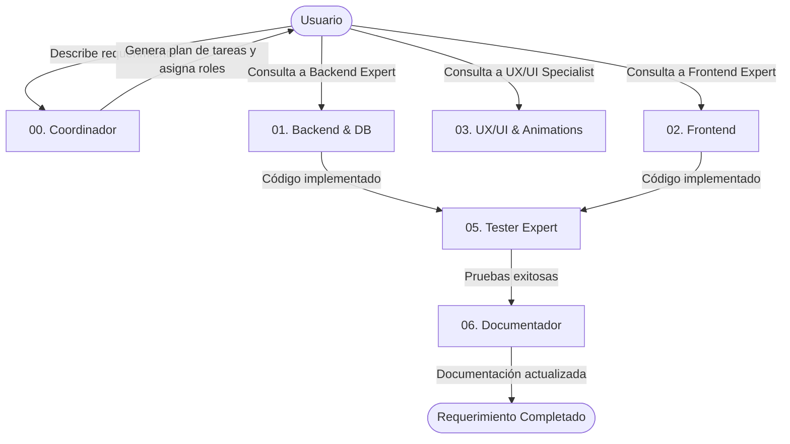

# Sistema de Agentes de Desarrollo Especializados · EduPlatform

Este directorio contiene las instrucciones del sistema (prompts de sistema) para configurar diferentes roles de Inteligencia Artificial (Copilotos de Desarrollo). Estos agentes están diseñados y contextualizados específicamente para el proyecto **EduPlatform**, facilitando la delegación de tareas del ciclo de desarrollo del software.

## ¿Cómo utilizar estos agentes?

Para usar cualquiera de estos agentes en tu flujo de trabajo (por ejemplo, en ChatGPT, Claude Code, Gemini, Copilot o cualquier otro asistente de IA):

1. **Abre el archivo Markdown** del agente que necesites.
2. **Copia todo su contenido** (las instrucciones del sistema).
3. **Pégalo al inicio de la sesión del chat** (o en la sección de instrucciones personalizadas/System Prompt) para inicializar el asistente en ese rol.
4. **Comienza a interactuar** pidiéndole tareas específicas que correspondan a su rol.

---

## Mapa de Agentes

| ID | Agente | Archivo | Propósito Principal |
| :--- | :--- | :--- | :--- |
| **00** | **Coordinador (Scrum Master)** | [00_coordinator.md](file:///c:/Users/Frank/Desktop/UNIVERSIDAD/6to%20SEM/Emprendimiento/PFINAL/EduPlatform/developer_agents/00_coordinator.md) | Organizar el roadmap, dividir problemas grandes en tareas sencillas, y velar por el cumplimiento de las convenciones de `CLAUDE.md`. |
| **01** | **Backend y DB Expert** | [01_backend_db_expert.md](file:///c:/Users/Frank/Desktop/UNIVERSIDAD/6to%20SEM/Emprendimiento/PFINAL/EduPlatform/developer_agents/01_backend_db_expert.md) | Desarrollar APIs Express, gestionar autenticación JWT, interactuar con `db.json` e implementar la migración a Prisma/PostgreSQL. |
| **02** | **Frontend Expert** | [02_frontend_expert.md](file:///c:/Users/Frank/Desktop/UNIVERSIDAD/6to%20SEM/Emprendimiento/PFINAL/EduPlatform/developer_agents/02_frontend_expert.md) | Crear componentes React 19, hooks de negocio, gestionar enrutamiento con React Router 7 y estados con Context API. |
| **03** | **Premium UX/UI Specialist** | [03_ux_ui_designer.md](file:///c:/Users/Frank/Desktop/UNIVERSIDAD/6to%20SEM/Emprendimiento/PFINAL/EduPlatform/developer_agents/03_ux_ui_designer.md) | Diseñar interfaces premium, animaciones Framer Motion, gráficos estadísticos, esquemas HSL sofisticados y temas de accesibilidad. |
| **04** | **Tutor IA y RAG Expert** | [04_ai_tutor_expert.md](file:///c:/Users/Frank/Desktop/UNIVERSIDAD/6to%20SEM/Emprendimiento/PFINAL/EduPlatform/developer_agents/04_ai_tutor_expert.md) | Optimizar la integración con la API de Gemini 3.5 Flash, diseñar prompts adaptativos VAK y el historial de chat persistente. |
| **05** | **QA y Testing Specialist** | [05_tester_expert.md](file:///c:/Users/Frank/Desktop/UNIVERSIDAD/6to%20SEM/Emprendimiento/PFINAL/EduPlatform/developer_agents/05_tester_expert.md) | Escribir y ejecutar pruebas unitarias con Vitest, realizar mocking de APIs e incrementar la cobertura de código. |
| **06** | **Documentador Técnico** | [06_documenter_expert.md](file:///c:/Users/Frank/Desktop/UNIVERSIDAD/6to%20SEM/Emprendimiento/PFINAL/EduPlatform/developer_agents/06_documenter_expert.md) | Mantener `DOCUMENTATION.md`, modelar diagramas de secuencia/flujo en Mermaid, y estructurar documentación de endpoints y APIs. |

---

## Flujo de Trabajo Recomendado

> [!IMPORTANT]
> Todos los agentes están configurados para responder en **español** por defecto y conocen la arquitectura exacta de carpetas de EduPlatform, asegurando que las sugerencias de código siempre encajen en el archivo y capa correctos sin generar código huérfano.
